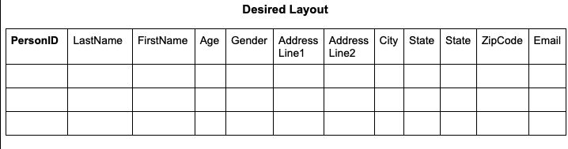
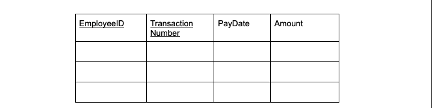

# Database Management ABC_Company Final Project
## Problem Description

This project focuses on designing a database system for ABC Company, a business that manages employees, customers, vendors, and products while streamlining its operations. The goal is to capture everything from employee management and job applications to product sales and vendor relationships, all in one place.

The database is already structured to enforce data integrity with primary and foreign keys, cascading deletions, and constraints on values like grades and credit ratings. From here, the task is to expand functionality by implementing views and queries to answer key questions, such as identifying top-selling products or employees with no supervisees.

This project is about taking the foundation we’ve built and extending it into a fully functional system. It’s designed to handle all of the company’s core operations while keeping the data clean, organized, and ready for analysis.

**Individual Contribution Breakdown**

| Contributor | Contribution |
|:------------|:--------------|
|**Rayeed Zarif:**|Wrote SQL for tables, relational schema, normalized relations, dependency diagram.|
|**Rohit Truesdale:**|SQL tables, SQL queries, created sample data set, set up multi-user database for collaboration, repurposed UTDhackthon code for DB Viewer for fun. |
|**Khanh Van**:|EER, SQL queries, SQL views.|

**Interact with our database here**
[Here](https://dbviewer.emerginary.com/)

**Credentials to connect to DB**:
- Host: 127.0.0.1
- Port: 9210
- User: root
- Password: password
- DBName: ABC_Company

[](https://www.youtube.com/watch?v=pB0_LHPj6-8)


# DATABASE SCHEMA DOCUMENTATION
## EER Diagram

1. **Drawn EER** to represent this set of requirements accurately. This will be the Conceptual Design. Clearly specifying any assumptions that we are making.


## Mapped EER Schema

2. **Mapped EER Schema** Map the EER to a database design.


## 3NF Relational Schema

- Normalized all of the tables to the third normal form. Made necessary changes to the EER. Explained why these changes were needed at the end.


### Changes Explained:

- **Person:FullAddress** was changed so it doesn’t have composite attributes.
- **Vendor:FullAddress** was changed so it doesn’t have composite attributes.
- **EmployeeDepartmentAssignment**: StartTime1, StartTime2, EndTime1, and EndTime2 were changed so an employee cannot have multiple department assignments.
- **Employee:SupervisorTitle** was changed so there aren’t any partial dependencies.
- **VendorPart:Part** was changed so it doesn’t violate 1NF.

## Dependency Diagram


## SQL for Databases, tables, and Other Structures

**Create Database ABC_Company;**

```sql
CREATE DATABASE ABC_Company;
USE ABC_Company;
```

### 1. **Department Table**


```sql
CREATE TABLE Department (
    Department_ID INT PRIMARY KEY,
    DepartmentName VARCHAR(50) NOT NULL
);
```

- **Primary Key**: Department_ID

### 2. **Person**




```sql
CREATE TABLE Person (
    PersonID INT PRIMARY KEY,
    LastName VARCHAR(20) NOT NULL,
    FirstName VARCHAR(20) NOT NULL,
    Age INT CHECK (Age < 65),
    Gender CHAR(1) CHECK (Gender IN ('M', 'F')),
    AddressLine1 VARCHAR(50),
    AddressLine2 VARCHAR(50),
    City VARCHAR(20),
    State VARCHAR(13),
    ZipCode INT
    Email VARCHAR(100);
);
```
- **Primary Key**: PersonID


### 3. **PhoneNumber**


```sql
CREATE TABLE PhoneNumber (
    PersonID INT,
    PhoneNumber VARCHAR(15),
    PRIMARY KEY (PersonID, PhoneNumber),
    FOREIGN KEY (PersonID) REFERENCES Person(PersonID) ON DELETE CASCADE
);
```
- **Primary Key**: (PersonID, PhoneNumber)
- **Foreign Key**: PersonID  (Foreign Key to Person.Person.ID)

### 4. **PersonType**


```sql
CREATE TABLE PersonType (
    PersonID INT,
    Type VARCHAR(20) NOT NULL,
    PRIMARY KEY (PersonID, Type),
    FOREIGN KEY (PersonID) REFERENCES Person(PersonID) ON DELETE CASCADE,
    CHECK (Type IN ('Employee', 'Customer', 'PotentialEmployee'))
);
```

- **Primary Key**: (PersonID, Type)
- **Foreign Key**: PersonID  (Foreign Key to Person.Person.ID)

### 5. **Employee**


```sql
CREATE TABLE Employee (
    PersonID INT PRIMARY KEY,
    Erank VARCHAR(50),
    Title VARCHAR(50),
    SupervisorID INT,
    FOREIGN KEY (PersonID) REFERENCES Person(PersonID) ON DELETE CASCADE,
    FOREIGN KEY (SupervisorID) REFERENCES Employee(PersonID) ON DELETE SET NULL
);
```
- **Primary Key**: PersonID
- **Foreign Key**: PersonID  (Foreign Key to Person.Person.ID)
- **Foreign Key**: SupervisorID  (Foreign key to Employee.PersonID)

### 6. **Customer**


```sql
CREATE TABLE Customer (
    PersonID INT PRIMARY KEY,
    FOREIGN KEY (PersonID) REFERENCES Person(PersonID) ON DELETE CASCADE
);
```
- **Primary Key**: PersonID
- **Foreign Key**: PersonID  (Foreign Key to Persons.PersonID)

### 7. **Preferred Salesperson**


```sql
CREATE TABLE PreferredSalesperson (
    CustomerID INT,
    SalesPersonID INT,
    PRIMARY KEY (CustomerID, SalesPersonID),
    FOREIGN KEY (CustomerID) REFERENCES Customer(PersonID) ON DELETE CASCADE,
    FOREIGN KEY (SalesPersonID) REFERENCES Employee(PersonID)
);
```
- **Primary Key**: (CustomerID, SalesPersonID)
- **Foreign Key**: CustomerID  (Foreign Key to Customer.PersonID)
- **Foreign Key**: SalesPersonID (Foreign Key to Employee.PersonID)

### 8. **EmployeeDepartmentAssignment**


```sql
CREATE TABLE EmployeeDepartmentAssignment (
    EmployeeID INT,
    DepartmentID INT,
    StartTime TIMESTAMP,
    EndTime TIMESTAMP ,
    FOREIGN KEY (EmployeeID) REFERENCES Employee(PersonID),
    FOREIGN KEY (DepartmentID) REFERENCES Department(Department_ID),
    PRIMARY KEY (EmployeeID, DepartmentID, StartTime)
);
```
- **Foreign Key**: EmployeeID (Foreign Key to Employee.PersonID)
- **Foreign Key**: DepartmentID  (Foreign Key to Department.DeparmentID)

### 9. **JobPosition**


```sql
CREATE TABLE JobPosition (
    JobID INT PRIMARY KEY,
    DepartmentID INT,
    JobDescription VARCHAR(50),
    PostedDate DATE,
    FOREIGN KEY (DepartmentID) REFERENCES Department(Department_ID)
);
```
- **Primary Key**: JobID
- **Foreign Key**: DepartmentID (Foreign Key to Deparment.DeparmentID)

### 10. **Application**


```sql
CREATE TABLE Application (
    ApplicationID INT PRIMARY KEY,
    ApplicantID INT,
    JobID INT,
    ApplicationDate DATE,
    FOREIGN KEY (ApplicantID) REFERENCES Person(PersonID),
    FOREIGN KEY (JobID) REFERENCES JobPosition(JobID)
);
```
- **Primary Key**: ApplicationID
- **Foreign Key**: ApplicantID (Foreign Key to Persons.PersonsID)
- **Foreign Key**: JobID (Foreign Key to Person.PersonID)

### 11. **Interview**


```sql
CREATE TABLE Interview (
    InterviewID INT PRIMARY KEY,
    JobID INT,
    CandidateID INT,
    InterviewTime TIMESTAMP,
    FOREIGN KEY (JobID) REFERENCES JobPosition(JobID),
    FOREIGN KEY (CandidateID) REFERENCES Person(PersonID)
);
```
- **Primary Key**: InterviewID
- **Foreign Key**: JobID (Foreign Key to JobPosition.JobID)
- **Foreign Key**: CandidateID (Foreign Key to Employee.PersonID)

### 12. **InterviewerAssignment**


```sql
CREATE TABLE InterviewerAssignment (
    InterviewID INT,
    InterviewerID INT,
    PRIMARY KEY (InterviewID, InterviewerID),
    FOREIGN KEY (InterviewID) REFERENCES Interview(InterviewID) ON DELETE CASCADE,
    FOREIGN KEY (InterviewerID) REFERENCES Employee(PersonID)
);
```
- **Primary Key**: (InterviewID, InterviewerID)
- **Foreign Key**: InterviewID (Foreign Key to Interview.InterviewID)
- **Foreign Key**: InterviewerID (Foreign Key to Employee.PersonsID)


### 13. **InterviewGrade**


```sql
CREATE TABLE InterviewGrade (
    InterviewID INT,
    InterviewerID INT,
    Grade INT CHECK (Grade BETWEEN 0 AND 100),
    PRIMARY KEY (InterviewID, InterviewerID),
    FOREIGN KEY (InterviewID) REFERENCES Interview(InterviewID) ON DELETE CASCADE,
    FOREIGN KEY (InterviewerID) REFERENCES Employee(PersonID)
);
```
- **Primary Key**: (InterviewID, InterviewerID)
- **Foreign Key**: InterviewID (Foreign Key to Interview.interviewID)
- **Foreign Key**: InterviewerID (Foreign Key to Employee.PersonID)


### 14. **Product**


```sql
CREATE TABLE Product (
    ProductID INT PRIMARY KEY,
    ProductType VARCHAR(50),
    Size VARCHAR(20),
    ListPrice DECIMAL(10, 2) CHECK (ListPrice > 0),
    Weight DECIMAL(5, 2) CHECK (Weight > 0),
    Style VARCHAR(20)
);
```
- **Primary Key**: ProductID

### 15. **Site**


```sql
CREATE TABLE Site (
    SiteID INT PRIMARY KEY,
    SiteName VARCHAR(25),
    Location VARCHAR(25)
);
```
- **Primary Key**: SiteId

### 16. **EmployeeSiteAssignent**


```sql
CREATE TABLE EmployeeSiteAssignment (
    EmployeeID INT,
    SiteID INT,
    StartDate DATE,
    EndDate DATE ,
    PRIMARY KEY (EmployeeID, SiteID, StartDate),
    FOREIGN KEY (EmployeeID) REFERENCES Employee(PersonID),
    FOREIGN KEY (SiteID) REFERENCES Site(SiteID)
);
```
- **Primary Key**: (EmployeeID, SiteID, StartDate)
- **Foreign Key**: EmployeeID (Foreign Key to Employee.PersonID)
- **Foreign Key**: SiteID (Foreign Key to Site.SiteID)

### 17. **Sale**


```sql
CREATE TABLE Sale (
    SalesID INT PRIMARY KEY,
    SalesPersonID INT,
    CustomerID INT,
    ProductID INT,
    SiteID INT,
    SalesTime TIMESTAMP,
    FOREIGN KEY (SalesPersonID) REFERENCES Employee(PersonID),
    FOREIGN KEY (CustomerID) REFERENCES Customer(PersonID),
    FOREIGN KEY (ProductID) REFERENCES Product(ProductID),
    FOREIGN KEY (SiteID) REFERENCES Site(SiteID)
);
```
- **Primary Key**: SalesID
- **Foreign Key**: SalesPersonID (Foreign key to Employee.personID)
- **Foreign Key**: CustomerID (Foreign Key to Customer.PersonID)
- **Foreign Key**: ProductID (Foreign Key to ProductID)
- **Foreign Key**: SiteID (Foreign Key to Product.ProductID)

### 18. **Vendor**


```sql
CREATE TABLE Vendor (
    VendorID INT PRIMARY KEY,
    Name VARCHAR(50),
    AddressLine1 VARCHAR(50),
    AddressLine2 VARCHAR(50),
    City VARCHAR(50),
    State VARCHAR(13),
    ZipCode INT,
    AccountNumber VARCHAR(20) UNIQUE,
    CreditRating INT CHECK (CreditRating BETWEEN 0 AND 10),
    PurchasingWebServiceURL VARCHAR(255)
);
```

- **Primary Key**: VendorID

### 19. **Part**


```sql
CREATE TABLE Part (
    PartID INT PRIMARY KEY,
    ProductID INT,
    Quantity INT CHECK (Quantity > 0),
    FOREIGN KEY (ProductID) REFERENCES Product(ProductID)
);
```
- **Primary Key**: PartID
- **Foreign Key**: ProductID (Foreign key ProductID)

### 20. **VendorPart**


```sql
CREATE TABLE VendorPart (
    VendorID INT,
    PartID INT,
    Price DECIMAL(10, 2) CHECK (Price > 0),
    PRIMARY KEY (VendorID, PartID),
    FOREIGN KEY (VendorID) REFERENCES Vendor(VendorID) ON DELETE CASCADE,
    FOREIGN KEY (PartID) REFERENCES Part(PartID)
);
```
- **Primary Key**: (VendorID, PartID)
- **Foreign Key**: VendorID (Foreign Key to Vendor.VendorID)
- **Foreign Key**: (Foreign Key to Part.PartID)

### 21. **ProductPart**


```sql
CREATE TABLE ProductPart (
    ProductID INT,
    PartID INT,
    Quantity INT CHECK (Quantity > 0),
    PRIMARY KEY (ProductID, PartID),
    FOREIGN KEY (ProductID) REFERENCES Product(ProductID),
    FOREIGN KEY (PartID) REFERENCES Part(PartID)
);
```
- **Primary Key**: (ProductID, PartID)
- **Foreign Key**: ProductID (Foreign Key to Product.ProductID)
- **Foreign Key**: PartID (Foreign Key to Part.PartID)

### 22. **Salary**


```sql
CREATE TABLE Salary(
EmployeeID int unique,
TransactionNumber int unique,
PayDate date,
Amount int,
FOREIGN KEY(EmployeeID) REFERENCES Person(PersonID)
);
```

- **Primary Key**: (EmployeeID, Transaction Number)
- **Foreign Key**: EmployeeID (Foreign Key to Employee.PersonID)


## Views

1. **View1**: This view returns the average salary each employee has earned from the company monthly after they become an employee.

```sql
CREATE VIEW AvgMonthlySalary AS
SELECT
    e.PersonID AS EmployeeID,
    CONCAT(p.FirstName, ' ', p.LastName) AS EmployeeName,
    AVG(s.Amount) AS AvgMonthlySalary
FROM
    Employee e
JOIN Person p ON e.PersonID = p.PersonID
JOIN Salary s ON e.PersonID = s.EmployeeID
GROUP BY e.PersonID, EmployeeName;
```


2. **View2**: This view returns the number of interview rounds each interviewee passes for each job position.

```sql
CREATE VIEW IntervieweePassCount AS
SELECT
    i.CandidateID AS IntervieweeID,
    CONCAT(p.FirstName, ' ', p.LastName) AS IntervieweeName,
    i.JobID,
    COUNT(*) AS PassedRounds
FROM
    Interview i
JOIN Person p ON i.CandidateID = p.PersonID
JOIN InterviewGrade ig ON i.InterviewID = ig.InterviewID
WHERE
    ig.Grade >= 70 -- Assuming 70 is the passing grade
GROUP BY i.CandidateID, i.JobID, IntervieweeName;
```


3. **View3**: This view returns the number of items of each product type sold.

```sql
CREATE VIEW ProductSalesCount AS
SELECT 
    p.ProductType,
    COUNT(s.ProductID) AS ItemsSold
FROM 
    Sale s
JOIN 
    Product p ON s.ProductID = p.ProductID
GROUP BY 
    p.ProductType;
```


4. **View4**: This view returns the part purchase cost for each product.

```sql
CREATE VIEW ProductPartCost AS
SELECT 
    p.ProductID,
    p.ProductType,
    SUM(pp.Quantity * vp.Price) AS TotalPartCost
FROM 
    Product p
JOIN 
    ProductPart pp ON p.ProductID = pp.ProductID
JOIN 
    Part pr ON pp.PartID = pr.PartID
JOIN 
    VendorPart vp ON pr.PartID = vp.PartID
GROUP BY 
    p.ProductID, p.ProductType;
```


# Query Questions
1. Return the ID and Name of interviewers who participate in interviews where the
interviewee's name is "Hellen Cole" arranged for job "11111"

```sql
SELECT DISTINCT i.InterviewerID, p.LastName, p.FirstName
FROM InterviewerAssignment i
JOIN Interview iv ON i.InterviewID = iv.InterviewID
JOIN JobPosition jp ON iv.JobID = jp.JobID
JOIN Person p ON i.InterviewerID = p.PersonID
WHERE iv.CandidateID = (SELECT PersonID FROM Person WHERE FirstName = 'Hellen' AND LastName = 'Cole')
  AND jp.JobID = 11111;
```

2. Return the ID of all jobs which are posted by department "Marketing" in January
2011.

```sql
SELECT j.JobID
FROM JobPosition j
JOIN Department d ON j.DepartmentID = d.Department_ID
WHERE d.DepartmentName = 'Marketing'
  AND j.PostedDate >= '2011-01-01'
  AND j.PostedDate < '2011-02-01'; 
```

3. Return the ID and Name of the employees having no supervisees.

```sql
SELECT e.PersonID, CONCAT(p.FirstName, ' ', p.LastName) AS Name
FROM Employee e
JOIN Person p ON e.PersonID = p.PersonID
WHERE e.PersonID NOT IN (
    SELECT SupervisorID
    FROM Employee
    WHERE SupervisorID IS NOT NULL
);
```

4. Return the Id and Location of the marketing sites with no sale records during March
2011.

```sql
SELECT s.SiteID, s.Location
FROM Site s
JOIN Department d ON d.DepartmentName = 'Marketing'
WHERE s.SiteID NOT IN (
    SELECT SiteID
    FROM Sale
    WHERE SalesTime BETWEEN '2011-03-01' AND '2011-03-31'
);
```

5.  Return the job's id and description, which does not hire a suitable person one month after it is posted.

```sql
SELECT jp.JobID, jp.JobDescription
FROM JobPosition jp
WHERE NOT EXISTS (
    SELECT 1
    FROM Application a
    WHERE a.JobID = jp.JobID
      AND a.ApplicationDate <= DATE_ADD(jp.PostedDate, INTERVAL 1 MONTH)
);
```

6. Return the ID and Name of the salespeople who have sold all product types whose
price is above $200.

```sql
SELECT sp.PersonID, CONCAT(p.FirstName, ' ', p.LastName) AS Name
FROM Employee sp
JOIN Person p ON sp.PersonID = p.PersonID
WHERE NOT EXISTS (
    SELECT pt.ProductType
    FROM Product pt
    WHERE pt.ListPrice > 200
    AND pt.ProductType NOT IN (
        SELECT DISTINCT pr.ProductType
        FROM Sale s
        JOIN Product pr ON s.ProductID = pr.ProductID
        WHERE s.SalesPersonID = sp.PersonID
    )
);
```

7. Return the department's id and name, which has no job post during 1/1/2011 and 2/1/2011.

```sql
SELECT d.Department_ID, d.DepartmentName
FROM Department d
WHERE d.Department_ID NOT IN (
    SELECT jp.DepartmentID
    FROM JobPosition jp
    WHERE jp.PostedDate BETWEEN '2011-01-01' AND '2011-02-28'
);
```

8. Return the ID, Name, and Department ID of the existing employees who apply for job "12345".

```sql
SELECT 
    e.PersonID AS EmployeeID, 
    CONCAT(p.FirstName, ' ', p.LastName) AS Name, 
    ed.DepartmentID
FROM Employee e
JOIN Person p ON e.PersonID = p.PersonID
JOIN Application a ON e.PersonID = a.ApplicantID
JOIN JobPosition jp ON a.JobID = jp.JobID
LEFT JOIN EmployeeDepartmentAssignment ed ON e.PersonID = ed.EmployeeID
WHERE jp.JobID = 12345;
```

9. Return the best seller's type in the company (sold the most items).

```sql

SELECT 
    pt.Type AS EmployeeType, 
    SUM(1) AS TotalSales
FROM Sale s
JOIN Employee e ON s.SalesPersonID = e.PersonID
JOIN PersonType pt ON e.PersonID = pt.PersonID
WHERE pt.Type = 'Employee'
GROUP BY pt.Type
ORDER BY TotalSales DESC
LIMIT 1;
```

10. Return the product type whose net profit is highest in the company (money earned minus the part cost).

```sql
SELECT pr.ProductType
FROM Product pr
JOIN ProductPart pp ON pr.ProductID = pp.ProductID
JOIN VendorPart vp ON pp.PartID = vp.PartID
GROUP BY pr.ProductType
ORDER BY (SUM(pr.ListPrice) - SUM(vp.Price)) DESC
LIMIT 1;
```

11. Return the name and id of the employees who have worked in all departments after being hired by the company.

```sql
SELECT e.EmployeeID AS PersonID, p.LastName, p.FirstName
FROM EmployeeDepartmentAssignment e
JOIN Person p ON e.EmployeeID = p.PersonID
GROUP BY e.EmployeeID, p.LastName, p.FirstName
HAVING COUNT(DISTINCT e.DepartmentID) = (SELECT COUNT(*) FROM Department);
```

12. Return the name and email address of the interviewee who is selected.

```sql
SELECT 
    CONCAT(p.FirstName, ' ', p.LastName) AS IntervieweeName,
    p.Email AS EmailAddress
FROM Interview i
JOIN Person p ON i.CandidateID = p.PersonID
WHERE EXISTS (
    SELECT 1
    FROM InterviewGrade ig
    WHERE ig.InterviewID = i.InterviewID
      AND ig.Grade >= 70 -- Assuming 70 is the passing grade
);
```

13. Retrieve the names, phone numbers, and email addresses of the interviewees
selected for all the jobs they apply for.

```sql
SELECT p.FirstName, p.LastName, ph.PhoneNumber
FROM Person p
JOIN PhoneNumber ph ON p.PersonID = ph.PersonID
JOIN InterviewGrade ig ON p.PersonID = ig.InterviewID;
```

14. Return the employee's name and id whose average monthly salary is the highest in
the company.

```sql
SELECT p.PersonID, p.FirstName, p.LastName
FROM Person p
JOIN Salary s ON p.PersonID = s.EmployeeID
GROUP BY s.EmployeeID
ORDER BY AVG(s.Amount) DESC
LIMIT 1
```

15. Return the ID and Name of the vendor who supplies part whose name is "Cup" and
weight is smaller than 4 pounds, and the price is lowest among all vendors.

```sql
SELECT 
    v.VendorID, 
    v.Name AS VendorName
FROM 
    Vendor v
JOIN 
    VendorPart vp ON v.VendorID = vp.VendorID
JOIN 
    Part p ON vp.PartID = p.PartID
WHERE 
    p.PartName = 'Cup'
    AND p.Weight < 4
    AND vp.Price = (
        SELECT MIN(vp2.Price)
        FROM VendorPart vp2
        JOIN Part p2 ON vp2.PartID = p2.PartID
        WHERE p2.PartName = 'Cup' AND p2.Weight < 4
    );
```